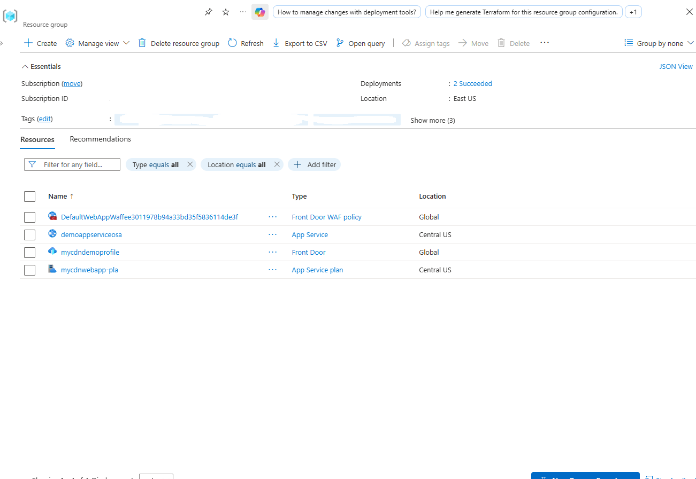
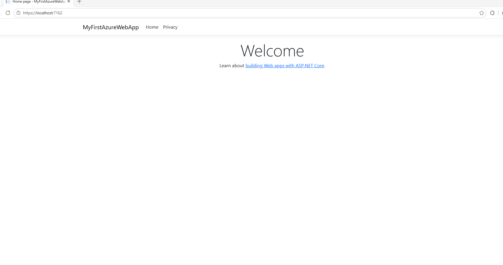
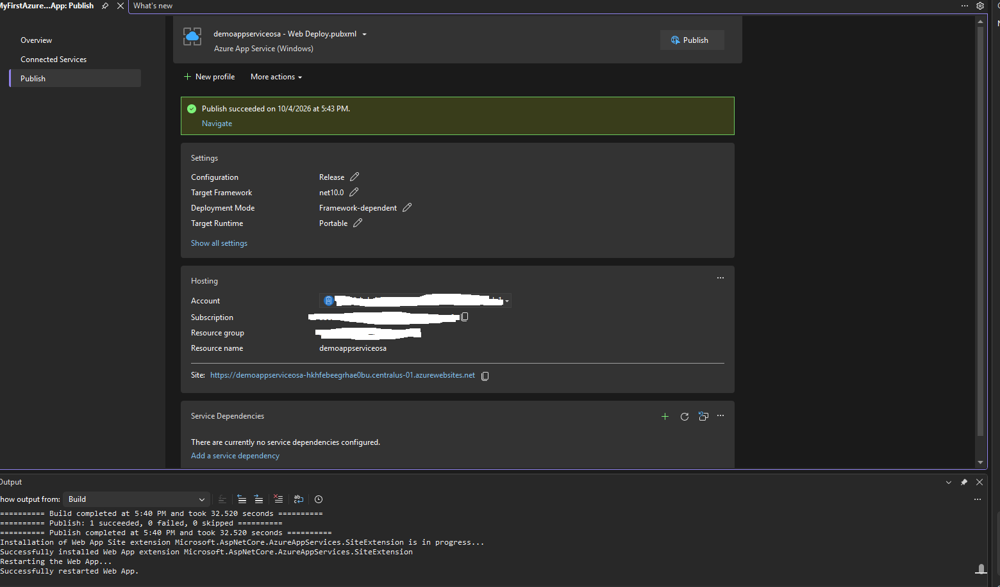
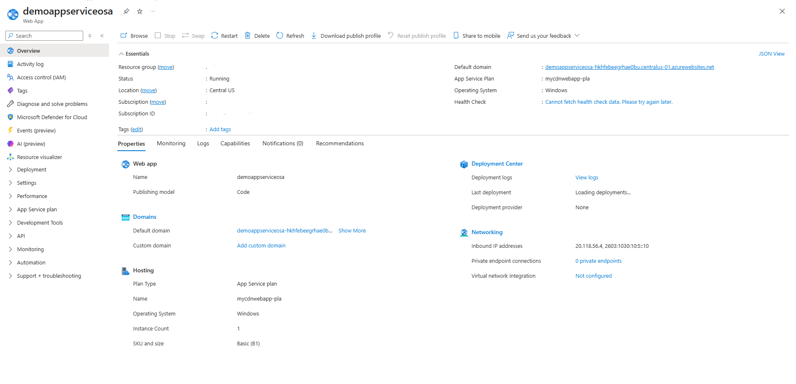
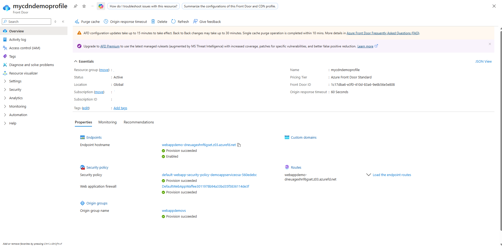

# Azure App Service Web App Integration with Azure Front Door and CDN Profile

Documentation detailing the end-to-end deployment of an ASP.NET Core web application to an Azure App Service Windows plan, the integration of an Azure Front Door and CDN profile, origin routing, Web Application Firewall (WAF) policy association, and endpoint validation.

---

## 1. Architecture & Provisioned Resources

All infrastructure was provisioned across Central US and Global scopes under a dedicated resource group:

* App Service Plan: mycdnwebapp-pla - Windows hosting plan provisioned in Central US under the Basic (B1) tier with 1 dedicated instance
* Web App: demoappserviceosa - Azure App Service running ASP.NET Core (.NET 10.0) hosted on Windows
* Front Door and CDN Profile: mycdndemoprofile - Standard_AzureFrontDoor global profile managing edge acceleration and caching
* Front Door Endpoint: webappdemo - Global endpoint hostname webappdemo-dneuagexhnf6gset.z03.azurefd.net routing external traffic
* Origin Group: webappdemovs - Configured origin group targeting demoappserviceosa over HTTPS on port 443 with automated health probes
* WAF Security Policy: DefaultWebAppWaffee3011978b94a33bd35f5836114de3f - Azure Front Door Web Application Firewall policy operating in Detection mode

*Resource group overview confirming the provisioned App Service, App Service plan, Front Door profile, and WAF policy.*

---

## 2. Step-by-Step Implementation

### Step 1: Local Application Verification

Validated the ASP.NET Core web application locally over HTTPS on port 7162 to ensure proper runtime execution before pushing artifacts to Azure.

*Local browser test confirming the running ASP.NET Core application.*

---

### Step 2: Publish Web App from Visual Studio

Deployed the application build from Visual Studio targeting the demoappserviceosa publish profile under the Release configuration and .NET 10 framework, confirming successful site extension installation and remote restart.

*Visual Studio publish output confirming successful artifact deployment to the Azure App Service.*

---

### Step 3: Inspect App Service Overview in Azure Portal

Navigated to demoappserviceosa in the Azure Portal to confirm that the service was in a Running state on mycdnwebapp-pla under the Basic (B1) tier, with its default domain generated.

*App Service overview pane verifying the Windows hosting tier, active status, and network properties.*

---

### Step 4: Configure and Verify Azure Front Door and CDN Integration

Configured mycdndemoprofile with origin group webappdemovs pointing directly to the App Service default hostname, bound the default routing path, enabled WAF security policy associations, and confirmed active endpoint provisioning.

*Front Door overview panel confirming provisioned endpoint, origin groups, routes, and security policies.*
